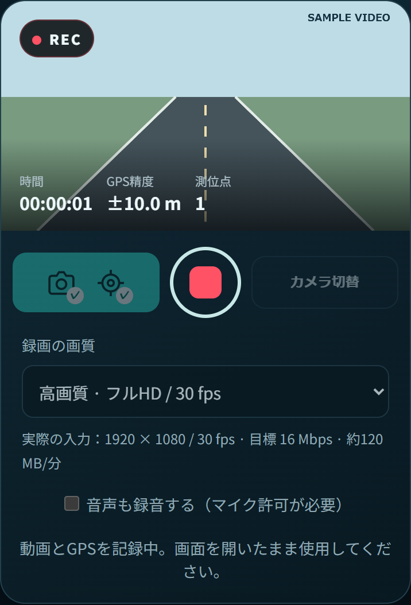
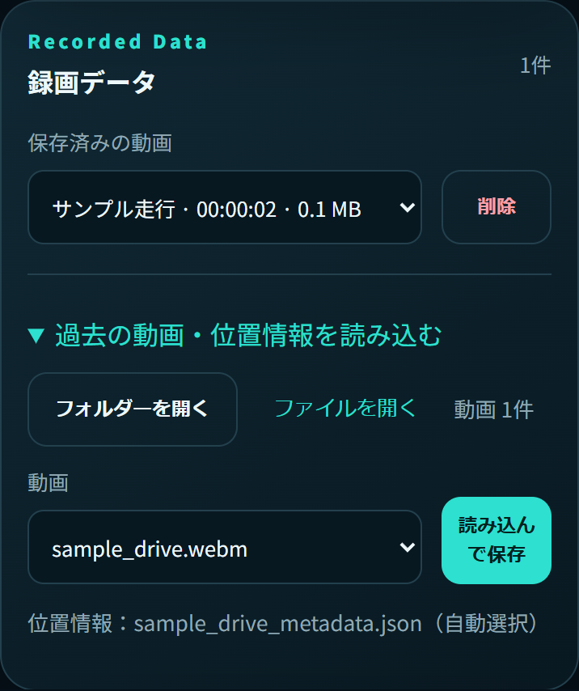
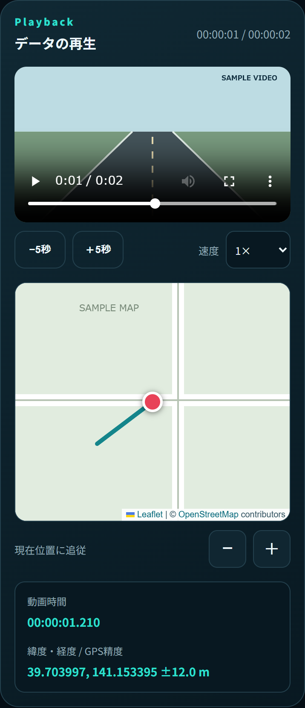
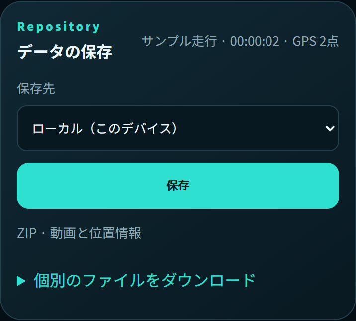
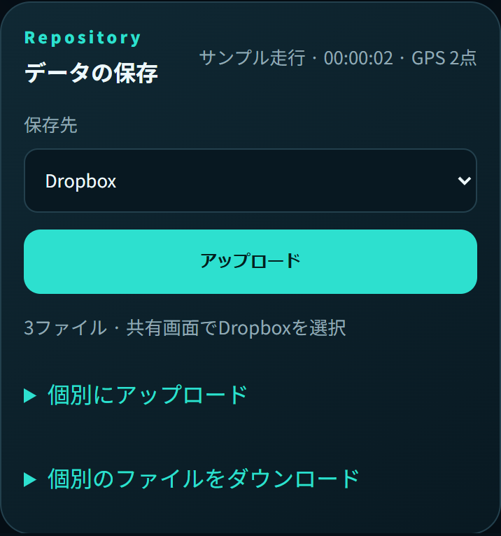

<p align="center"></p>

# Road Damage Analysis

**道路の動画とGPSを一緒に記録し、動画の再生位置に合わせて走行軌跡を確認するアプリです。** Android・iPhoneのブラウザで利用できるPWAです。

撮影 → 録画データを選択 → 動画と軌跡を再生 → ローカル／Dropboxへ保存、の順に操作します。

[撮影する](#capture) · [画質を選ぶ](#quality) · [過去の動画を開く](#library) · [再生する](#playback) · [保存する](#save) · [困ったとき](#help) · [開発者向け](#development)

> 以下はスマートフォン幅で表示した実際のアプリ画面です。映像・GPS・地図は説明用のサンプルデータです。iPhone Safariの実機スクリーンショットではありません。端末によって動画形式、権限ダイアログ、共有画面は異なります。

## はじめに

- **HTTPSで配信されたアプリ**をブラウザで開きます。開発時は `localhost` でも利用できます。
- 撮影にはカメラと位置情報の許可が必要です。音声を録音する場合だけ、マイクも許可します。
- 地図の表示にはインターネット接続が必要です。
- 長時間撮影する場合は空き容量とバッテリーを確認し、撮影画面を前面に保ってください。

<a id="capture"></a>

## 1. 撮影する



1. 左側の**カメラ・GPSアイコンのボタン**を押し、両方の利用を許可します。利用可能になるとそれぞれにチェックが付きます。
2. 「録画の画質」を選びます。必要に応じて「音声も録音する」をオンにします。
3. GPSを取得できたら、中央の**赤い丸ボタン**を押して撮影を始めます。
4. 終了するときは、中央の**四角い停止ボタン**を押します。保存が終わるまで画面を閉じないでください。
5. 録画が「Recorded Data／録画データ」に登録され、動画と軌跡が表示されます。

右側の「カメラ切替」で前後のカメラを切り替えられます。撮影中は画質・カメラの変更はできません。

### どのくらい録画できますか？

**アプリ独自の時間・サイズ上限はありません。通常は停止ボタンを押すまで継続します。** 512 MBでの自動停止はありません。

ただし、録画中のデータは分割した動画データとして保持し、停止後にブラウザ内へ保存するため、ブラウザが使えるメモリと保存容量に依存します。端末全体の空き容量をすべて使えるとは限りません。

画面が非表示になっただけではアプリから停止しませんが、iPhone SafariやOSは画面ロック・他アプリへの切替などで撮影を中断することがあります。カメラ切断・録画エラー・ページを閉じる／移動する場合も終了します。**長時間撮影では画面を開いたまま使用してください。** 対応端末ではスリープを抑止し、画面復帰時に再取得します。

<a id="quality"></a>

## 2. 画質を選ぶ

設定は次回起動時にも保持されます。カメラ開始後、画質欄の下に**実際の入力解像度・fps**と概算容量が表示されます。

| 設定 | 希望する解像度・fps | 目標ビットレート | 選び方 |
| --- | --- | --- | --- |
| 高画質（標準） | フルHD／30 fps | 16 Mbps | まずはこの設定から |
| 最高画質 | 4K／30 fps | 45 Mbps | 細部を重視し、容量に余裕がある場合 |
| 動き優先 | フルHD／60 fps | 24 Mbps | 動きの滑らかさを重視する場合 |
| 容量優先 | HD／30 fps | 6 Mbps | 容量を抑えたい場合 |

フルHDは1920 × 1080、4Kは3840 × 2160、HDは1280 × 720です。対応できない設定は端末に合わせて調整されます。4K・60fps・指定ビットレートをすべての端末で保証するものではありません。

動き優先では、対応ブラウザでカメラ本来の映像を取得し、iPhone／iPadでは対応していればMP4を優先します。プレビューと再生は動画の縦横比を保持します。高画質ほど容量・メモリの消費が増えます。

<a id="library"></a>

## 3. 過去の動画を開く



### このブラウザに保存した録画

「保存済みの動画」のプルダウンを選ぶと、動画と軌跡が自動表示されます。「削除」は選択した録画と位置情報をこのブラウザから削除します。

### 端末やクラウドから書き出したファイル

1. 「過去の動画・位置情報を読み込む」を開きます。
2. **「フォルダーを開く」**で動画と位置情報が入ったフォルダーを選びます。ZIPは先に展開してください。
3. 「動画」のプルダウンから動画を選びます。1本だけなら自動選択されます。
4. ファイル名から対応する位置情報が自動選択されます。表示されたファイル名を確認して、**「読み込んで保存」**を押します。

フォルダーを選択できない端末・ファイル提供元では、「ファイルを開く」で動画と関連ファイルをまとめて選択してください。位置情報専用の選択欄はありません。

> **動画だけを選べば位置情報も読めますか？**
> ブラウザは、動画1ファイルを選択しただけでは隣のファイルを読めません。最初にフォルダーを選択する必要があります。ただし同じ端末に元の録画が残り、書き出した動画の記録IDとサイズが一致する場合は、端末内の位置情報を再利用します。対応する位置情報がない動画も再生できます。

### ファイル名の組み合わせ

| 動画 | 自動照合する位置情報 |
| --- | --- |
| `road_damage_ID.webm` または `.mp4` | `road_damage_ID_metadata.json`、`road_damage_ID_metadata.json.txt`、`road_damage_ID_gps.csv` |
| `video.webm` または `.mp4`（展開したZIP） | 同じフォルダーの `metadata.json` または `gps.csv`。動画が1本の場合 |
| `sample_drive.mp4` | `sample_drive.json`、`sample_drive_gps.csv`、`sample_drive.csv` など |

JSONをCSVより優先します。別フォルダーやファイル名の部分一致では照合しません。同名候補が重複して区別できない場合は読み込みを止めます。旧版の `recording_ID`／`metadata_ID`／`gps_ID`、旧JSONの `frames` 配列、BOM付きCSVにも対応します。

<a id="playback"></a>

## 4. 動画と走行軌跡を確認する



- 動画を再生・シークすると、その時刻の位置が地図の中央に表示されます。
- **−5秒／＋5秒**で移動し、**0.5〜2倍速**で再生できます。
- 地図の**＋／−**、2本指のピンチ操作、マウスホイールで拡大・縮小できます。
- 動画時刻・緯度経度・GPS精度は地図の下に表示されます。

撮影中の「移動軌跡」も現在位置を中央に表示します。画面上部のナビゲーションで「撮影」「録画データ」「再生」「保存」に移動できます。

<a id="save"></a>

## 5. ローカル・Dropboxへ保存する

**撮影後の録画は、まずこのブラウザ内に保存されます。** ファイルとして端末やDropboxに残すには「Repository／データの保存」から書き出してください。

| ローカル（このデバイス） | Dropbox |
| --- | --- |
|  |  |
| 保存先を「ローカル」にして**「保存」**を押します。動画と位置情報をZIPにまとめます。 | 保存先を「Dropbox」にして**「アップロード」**を押し、OSの共有画面でDropboxを選びます。 |

Dropboxアプリのインストール・ログインが必要です。アプリ内でDropboxにログインして直接送信する方式ではありません。**保存完了はDropbox側で確認してください。**

共有ファイルは録画終了・読み込み・動画選択時に自動準備します。準備中はアップロードボタンが無効になり、完了すると押せます。

### 保存されるもの

| ファイル | 内容 |
| --- | --- |
| 動画（WebM／MP4） | 撮影した映像。ZIP化しても再圧縮しません |
| GPSログ（CSV） | 測位した時刻・緯度・経度・精度など |
| フレーム対応表（JSON） | GPSログ、撮影設定、各フレームの推定位置 |

ローカルZIPには `video.webm` または `video.mp4`、`gps.csv`、`metadata.json`、`README.txt` が入ります。Dropbox共有では共通ID付きの3ファイルを送り、Androidとの互換性のためフレーム対応表の拡張子は `.json.txt` です。中身はJSONで、そのまま再読み込みできます。

まとめて共有できない場合は「個別にアップロード」を開き、3ファイルを1つずつ共有してください。「個別のファイルをダウンロード」から個別保存もできます。約4 GB以上のデータはZIPにまとめられないため、個別ダウンロードを利用してください。

<a id="help"></a>

## 困ったとき

| 症状 | 確認すること・対処 |
| --- | --- |
| カメラが表示されない | HTTPSで開いているか、ブラウザのサイト設定でカメラを許可しているか確認し、許可ボタンを押し直します。他のカメラアプリも閉じてください |
| 録画ボタンを押せない | カメラとGPSの両方が利用可能か確認します。新しいGPSの測位を待ちます |
| 4K／60fpsにならない | 画質欄の「実際の入力」を確認します。端末・カメラ・ブラウザの対応範囲に調整されます |
| 位置情報が自動選択されない | 動画と関連ファイルが同じフォルダーにあり、共通のファイル名になっているか確認します |
| 地図が表示されない | 通信を確認し、「地図を再取得」を押します。地図タイル取得失敗時も軌跡・マーカー・ズーム操作は維持されます |
| Dropboxが出ない／送れない | Dropboxアプリを確認し、個別アップロードを試します。難しい場合はローカル保存後にDropboxアプリから送ります |
| ブラウザへの保存に失敗した | 空き容量を確認します。画面を閉じずに「データの保存」からダウンロードしてください |
| 更新が反映されない | アプリのタブとホーム画面から開いたアプリをすべて閉じ、再度開きます |

## データの扱いと制約

- ブラウザのデータ消去や空き容量不足で履歴を失うことがあります。大切な記録はファイルにも書き出してください。旧版で既に失われた録画は復元できません。
- **各フレームの位置はGPSサンプルから補間した推定値です。** フレームごとの実測GPSではありません。フレーム時刻もカメラの報告fpsに基づく推定値で、実際にエンコードされたフレーム時刻を保証しません。
- 他端末から読み込む動画は、使用中のブラウザがその形式に対応している必要があります。
- 動画・GPSは共有操作まで端末内で処理します。地図にはOpenStreetMapを利用し、タイル取得先には表示範囲とIPアドレスが伝わります。
- 録画中のデータはディスクへの逐次保存ではありません。OSによる強制終了時の保存や、メモリ不足直前の検知は保証できません。

<a id="development"></a>

## 開発者向け

ビルド不要の静的アプリです。アプリ本体のHTML・JavaScript・画像・マニフェストと `vendor/` をHTTPSで配信します。開発時は、例えばプロジェクトのルートで `python -m http.server 8000` を実行し、同じPCの `http://localhost:8000` を開けます。携帯からPCのHTTPアドレスを開く方法ではカメラ権限の条件を満たさないため、携帯での確認にはHTTPSを用意してください。

| 主なファイル | 役割 |
| --- | --- |
| `index.html` / `app.js` | 画面・撮影・再生・操作 |
| `quality.js` | 画質設定・撮影条件・録画形式 |
| `storage.js` | IndexedDBへの保存。既存の録画を引き継ぐためDB名を維持 |
| `import-controller.js` / `import-matching.js` | ファイル読み込み・自動照合 |
| `core.js` / `map-view.js` | 位置の補間・解析、Leafletによる地図表示 |
| `export.js` / `export-worker.js` | ZIP・CSV・JSON・共有用ファイルの準備 |
| `sw.js` / `manifest.webmanifest` | PWAとキャッシュ。更新は録画を妨げないよう次回起動時に適用 |
| `vendor/leaflet/` | 同梱したLeaflet 1.9.4のJS・CSS・画像 |

録画はエンコード済みBlobとして保持し、停止後にIndexedDBへ保存します。一覧はサマリーのみを取得します。録画開始時に前の再生・書き出しデータを解放します。撮影設定はmetadataの `capture` に記録します。共有ファイルの生成はWorkerで行います。

### テスト

```sh
node --test tests/*.test.js
```

ブラウザ統合テストはPlaywrightを別途用意して実行します。

```sh
npm install --no-save playwright
npx playwright install chromium
node tests/browser.mjs
```

映像・測位・地図タイル・共有先は模擬データです。MediaRecorder・IndexedDB・Leaflet・ZIP処理は実装を使います。ファイル照合、画質、録画映像の比率、再生・保存・共有、サイズ上限を設けない動作、画面復帰時の処理などを検証します。

実機ではAndroid Chrome／iPhone Safariの権限、前後カメラ、音声、長時間録画、ロック・バックグラウンド移行、保存容量不足、Dropbox共有を別途確認してください。

### README画像の更新

```sh
node scripts/capture-docs.mjs
```

現在のUIをスマートフォン幅で開き、説明用のカメラ映像・GPS・地図を使って `docs/screenshots/` に5枚のPNGを生成します。外部へのアップロードは行いません。

テストと画像生成の両方で、`PLAYWRIGHT_MODULE` にPlaywrightのモジュールURL、`BROWSER_EXECUTABLE` にブラウザ実行ファイルを指定できます。テスト画像・ZIPの保存先は `TEST_OUTPUT_DIR` で指定します。
